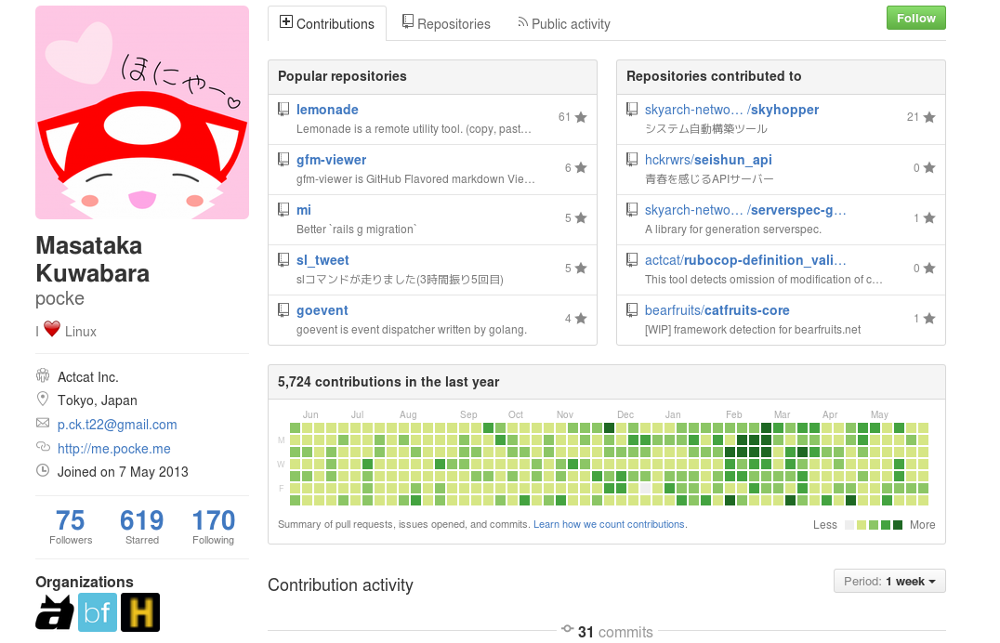
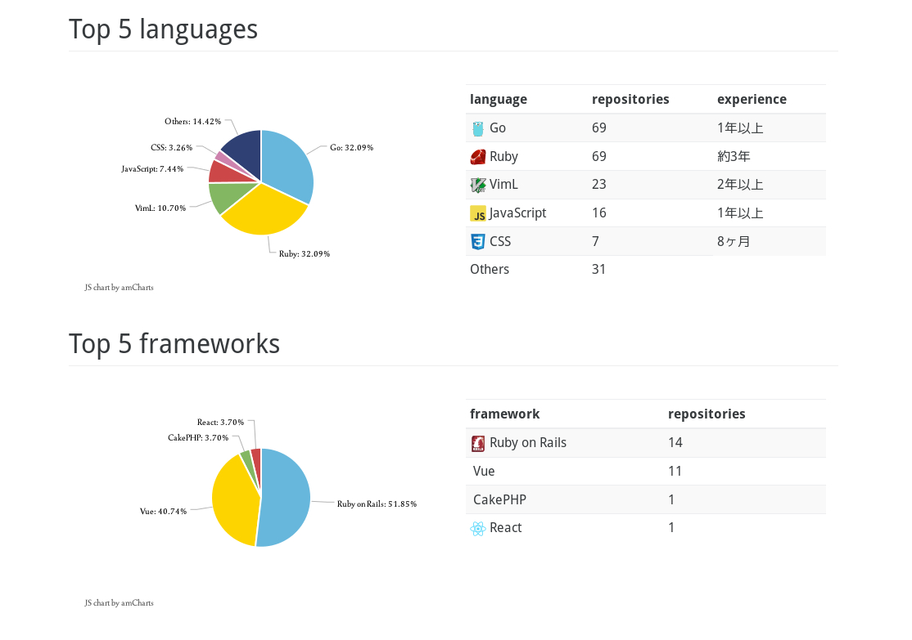
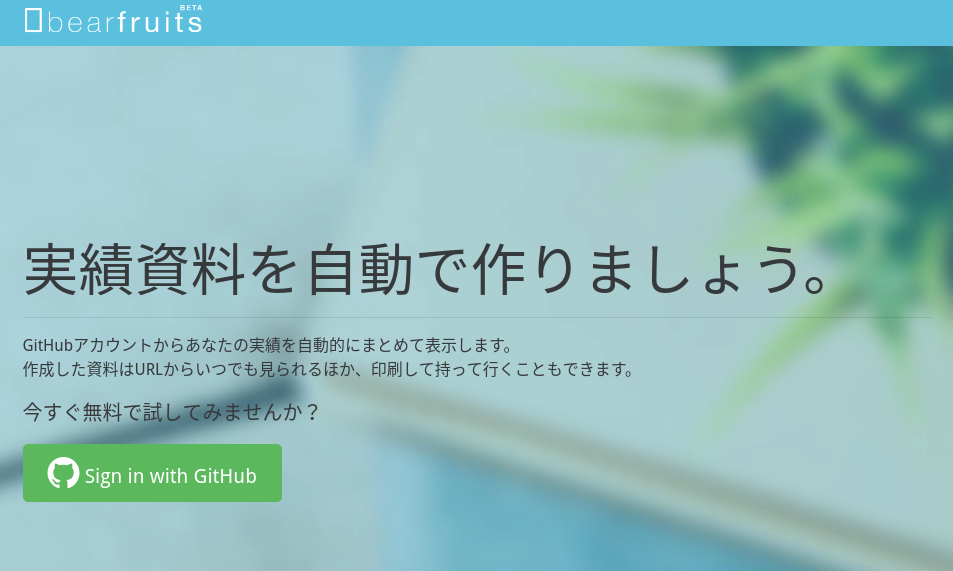
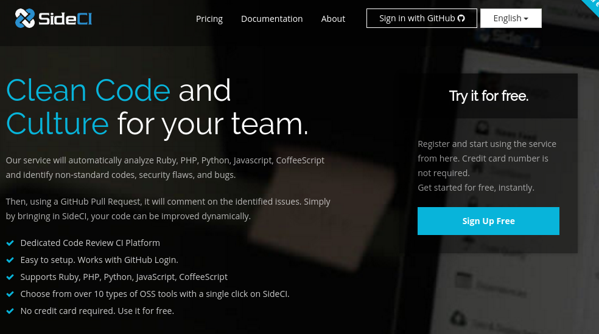
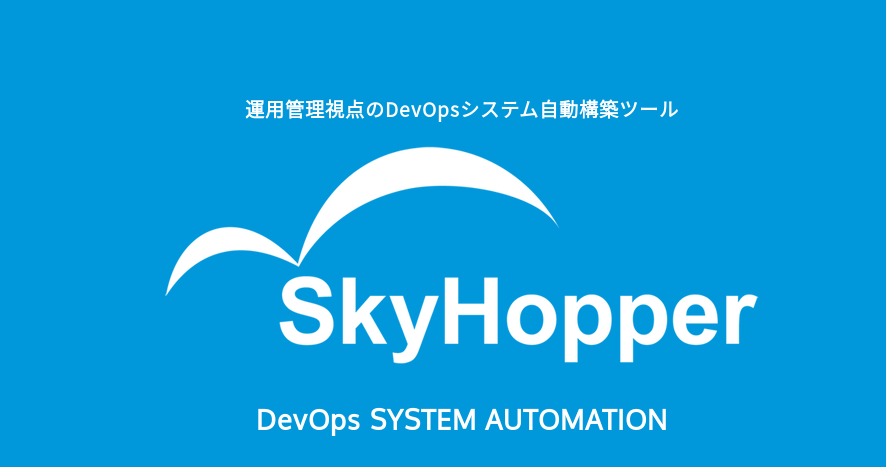

# About pocke

---

## Self-introduction

---

Masataka Kuwabara (a.k.a. pocke)

Student at Open University of Japan.

Work at Actcat Inc. and PORT INC.

---

## Skill

---

- Web
  - Ruby on Rails
  - Server-side and Client-side
- Command-Line Tool
- Library

---

## interested

---

- OSS
- Relational Database
- Puzzle Game
  - Sudoku, Nonogram
  - Solve by SAT Solver.
- *NIX
- (Natural | Programming) Language

---

## GitHub (and Grasses)

---

<small>
[https://github.com/pocke](https://github.com/pocke)
</small>

---

Languages And Frameworks

---

<small>
Generated by [bearfruits.net](https://bearfruits.net)
</small>

---

## Web Services

---

### bearfruits

---

<small>
[bearfruits.net](https://bearfruits.net)
</small>

---

### SideCI

---

---

### SkyHopper

---

---

## Contributions to OSS

---

- rails/rails
- bbatsov/rubocop
- todesking/ruby_hl_lvar.vim
  - Committer
- and gems, CLI-tools, libraries and Vim plugins

---

## Awards

---

- mixi git challenge 2016
  - 1st
- Hacker Wars 3
  - an award of a company
