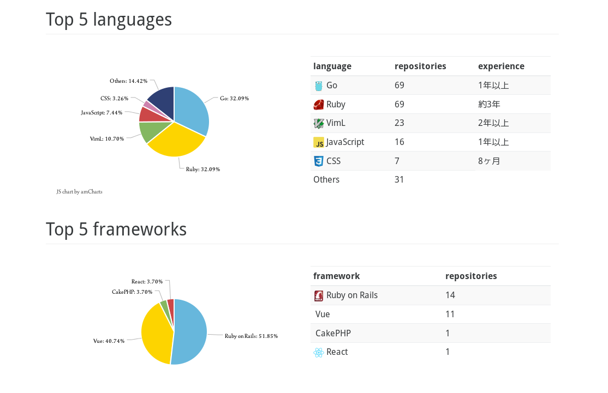

# About pocke

---

## Self-introduction

---

Masataka Kuwabara (a.k.a. pocke)

Student at Open University of Japan.

---

- Web (Server & Client)
- Command-Line Tool
- Library

---

<small>
[https://github.com/pocke](https://github.com/pocke)
</small>

---

<small>
[https://rubygems.org/profiles/pocke](https://rubygems.org/profiles/pocke)
</small>

---

<small>
Generated by [bearfruits.net](https://bearfruits.net)
</small>

---

## Products

---

### bearfruits

---

<small>
[bearfruits.net](https://bearfruits.net)
</small>

---

### SideCI

---

---

- TerminalQ
- SkyHopper

...and many command-line tools, libraries, and vim plugins!
